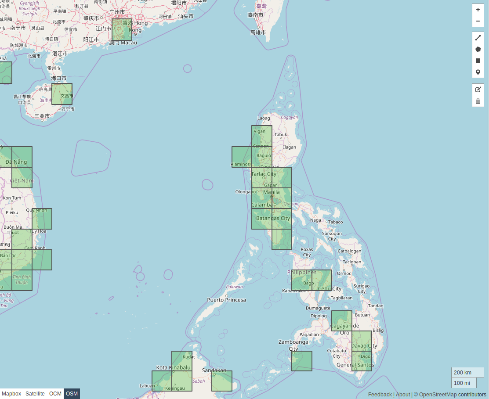

# Coverage Map

The coverage map creation is dependent on the generation of the reference speed tiles via the ref-tile-work.py script.  The map is dependent on these tiles because just the presence of them indicates coverage and we want to obtain the begin and end range in the metadata keys for each reference tile.  Metadata keys were used so that the coverage map script would not have to download and open each file in order to obtain the begin and end range.  Note that all user custom metadata can only be string and will have a prefix of x-amz-meta-; therefore, our keys are named x-amz-meta-rangestart and x-amz-meta-rangeend.  x-amz-meta-rangestart is the minimum start time and the x-amz-meta-rangeend is the maximum time covered in the reference tile.  Both metadata keys are stored in epoch time and are added to the tiles when they are uploaded to AWS via the ref-tile-work.py script.  Also, the coverage map script only deals with level 1 tiles for determining coverage.
## Arguments
--ref-speed-bucket: AWS Reference Speed Tile Bucket. 
--output-file: Specify the output file; otherwise, it will be saved to coverage_map.geojson. 
--upload-results: Do you want to upload the coverage map to the AWS Reference Speed Tile Bucket when complete? 

## GeoJSON Properties
In addition to styling attributes, we also store the tileid, rangeStart, rangeEnd, rangeStartDate, and rangeEndDate in the geojson properties for each feature.  The rangeStart and rangeEnd is in epoch time.  The rangeStartDate and rangeEndDate is the formated date and time of the corresponding epoch values.  The dates are formatted as %Y-%m-%d %H:%M:%S.

## Feature Geometry
Each feature's geometry is the bounding box of the tile.

## Sample Coverage Map

Image generated using http://geojson.io
